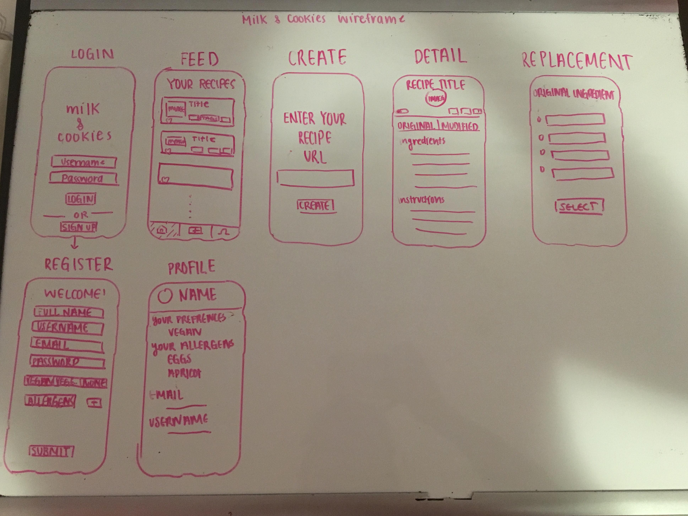

Original App Design Project
===

# milk & cookies

## Table of Contents
1. [Overview](#Overview)
1. [Product Spec](#Product-Spec)
1. [Wireframes](#Wireframes)
2. [Schema](#Schema)

## Overview
### Description
milk & cookies is an Android Application that extracts replaceable ingredients from a recipe, and automatically suggests alternatives. Users can choose which ingredients they would like to replace and select an alternative that fits their needs. The extension updates the recipe on the website to display the replacements and their corresponding measurements in order to successfully meet the user's needs.

Faced with the challenge of finding recipes that meet our dietary needs, I built milk & cookies with the goal of personalizing the baking experience to make it more accessible for all.

### App Evaluation
- **Category:** Cooking
- **Mobile:** Mobile application, convenient for cooking in the kitchen 
- **Story:** Allows users to find replacements to different ingredients in recipes for dietary restrictions and allergies
- **Market:** Anyone that cooks or bakes frequently and wants to find alternatives for ingredients in their recipes
- **Habit:** Users will often be finding new recipes for their daily meals or occasional new desert recipe but might not have all the ingredients they need to make it, can't find recipes that meet their dietary restrictions, or find recipes with measurements in other units can consistently use the application to quickly find them the changes they need
- **Scope:** Initial app will have a narrow scope, finding ingredient alternatives to dietary restrictions and changing recipe units. As we grow we can add features like searching for new recipes, saving recipes to a favorites section, etc.

## Product Spec

### 1. User Stories (Required and Optional)

**Required Must-have Stories**

* Users can login
* Users can register a new account
*   * Users can set allergens and dietary restrictions (vegan, vegetarian, etc.) when signing up for an account
* Users can logout
* User can add a new recipe through a link
* User can convert recipes from metric --> united states measurement system, or vice versa
* User can see replacements for ingredients in recipes 
* Users can select replacements for ingredients and will replace on recipe


**Optional Nice-to-have Stories**

* Users can favorite recipes to revisit frequently
* Users can search for recipes in-application


### 2. Screen Archetypes

* Login
   * User can login
* Register
   * Users can register a new account
* Stream
    * User can view all previously added recipes with changes made
    * Users can see favorited recipes
    * Users can search through their recipes
* Creation
    * User can add a new recipe through a URL
* Detail Recipe
    * Users can view recipes in their changed and original state
* Profile
    * Users can see their information (dietary restrictions, allergies)

### 3. Navigation

**Tab Navigation** (Tab to Screen)

* Stream
* Profile
* Create


**Flow Navigation** (Screen to Screen)

* Login
    * Stream
* Register
    * Stream
* Stream
    * Detail Recipe
* Creation
    * Stream
* Detail Recipe
    * Stream
* Profile

## Wireframes



## Schema 
### Models
Users
|     Property  | Type          | Description  |
| ------------- | ------------- | -------------
|  objectId	  | String  | unique id for the user (default field) |
| username  | String  | username of the user |
| password  | String  | password of the user |
| email  | String  | email of the user, can be used to email recipes |
| dietary prefrence  | String  | limited range of options (vegan, vegetarian, pescetarian) |
| allergens  | JSONArray  | list of allergens |


Note: Can use PollsAPI to handle the following Models instead of ParseDatabase

Recipe 

|     Property  | Type          | Description  |
| ------------- | ------------- | -------------
|  objectId	  | String  | unique id for the user poll (default field) |
| owner  | Pointer to user  | creator of the new modified recipe |
| ingredients_original  | JSONArray  | list of original ingredients |
| ingredients_modified  | JSONArray  | list of modified ingredients  |
| instructions  | String  | raw text for instructions of the recipe |
| tags  | JSONArray  | tags for what dietary groups recipe applies to  |


### Networking
**List of Network Requests by screen

* Login
    * Authenticate User
* Register
    * Create User
* Feed
    * Get all recipes based on User
    * Add recipe to favorite, remove recipe from favorites
* Create Recipe
    * Create Recipe
* Recipe Detail
    * Get specific recipe
* Profile
    * Get User Information
    
**Basic Code Snippets for Network Requests**

Sign Up User
```java
ParseUser user = new ParseUser();
        user.setUsername(username);
        user.setPassword(password);
        user.signUpInBackground(new SignUpCallback() {
            public void done(ParseException e) {
                if (e == null) {
                    goMainActivity();
                    Toast.makeText(LoginActivity.this, "Success!", Toast.LENGTH_SHORT).show();
                } else {
                    Log.e(TAG, "Issue with login", e);
                    return;
                }
            }
        });
```
Log In User
```java
ParseUser.logInInBackground(username, password, new LogInCallback() {
            @Override
            public void done(ParseUser user, ParseException e) {
                if (e != null) {
                    Log.e(TAG, "Issue with login", e);
                    return;
                }
                goMainActivity();
                Toast.makeText(LoginActivity.this, "Success!", Toast.LENGTH_SHORT).show();
            }
        });
```
Retrieve Recipes Based on User
``` java
        ParseQuery<Post> query = ParseQuery.getQuery(Poll.class);
        query.include(Poll.KEY_USER);
        query.setLimit(30);
        query.addDescendingOrder("createdAt");
        query.whereEqualTo(Poll.KEY_USER, "user pointer here")
        query.findInBackground(new FindCallback<Poll>() {
            public void done(List<Poll> itemList, ParseException e) {
                if (e == null) {
                    pAdapter.clear();
                    polls.addAll(itemList);
                    pAdapter.notifyDataSetChanged();
                } else {
                    Log.d("item", "Error: " + e.getMessage());
                }
            }
        });
```
Create a New Vote
``` java
        ParseObject vote =  ParseObject.create("Recipe");
                // put necessary recipe parameters
                vote.saveInBackground(new SaveCallback() {
                    @Override
                    public void done(ParseException e) {
                        if (e == null) {
                            dismiss();
                        }
                    }
                });
```

**Endpoints for Spoonacular API**
Base URL: https://api.spoonacular.com/recipes/

<!-- 

|     HTTP Verb  | Endpoint          | Description  |
| ------------- | ------------- | -------------
|  POST	  | /create/poll  | Creates a new poll |
| GET  | get/poll/{poll_id}  | Gets a poll with specified poll ID |
| GET | /get/polls?offset=0&limit=25 | Gets all polls |
| POST  | /create/vote  | Creates a new vote|
| POST  | /remove/vote  | Removes a vote|
| POST  | /remove/poll  | Removes a poll| -->


